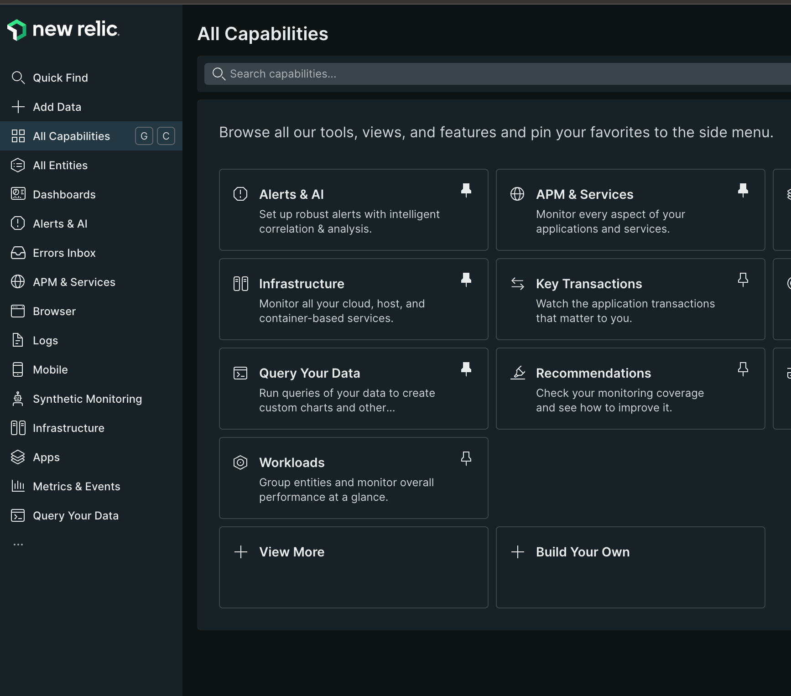
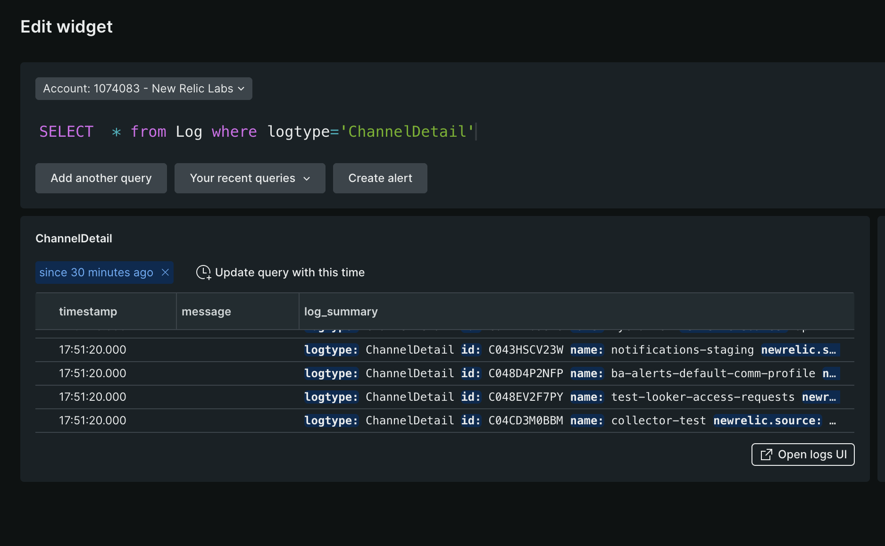

<a href="https://opensource.newrelic.com/oss-category/#new-relic-experimental"><picture><source media="(prefers-color-scheme: dark)" srcset="https://github.com/newrelic/opensource-website/raw/main/src/images/categories/dark/Experimental.png"><source media="(prefers-color-scheme: light)" srcset="https://github.com/newrelic/opensource-website/raw/main/src/images/categories/Experimental.png"></picture></a>


# Slack Logs to New Relic Log API
Send following Slack API logs to New Relic's Log API. 🚧 This project is currently work in progress and supports following logs collection
- [ChannelDetail](https://api.slack.com/methods/conversations.list)
- [UserLogs](https://api.slack.com/methods/users.list)
- [AccessLogs](https://api.slack.com/methods/team.accessLogs)
- [ConversationLogs](https://api.slack.com/methods/conversations.history)
- [AuditLogs](https://api.slack.com/admins/audit-logs) 

### Prerequisites
- Install Slack app with required permissions and collect user token. Use this token as a SLACK_ACCESS_TOKEN system variable. Currently, SlackLogsIntegration requires following permissions.<br>
      ```admin, users:read, channels:read, teams:read, channels:history, auditlogs:read ```

  Please [refer Development](#Development) if you need help to create a Slack app.
- Get New Relic ingest key. Use this key as a INGEST_KEY system variable.

### Installation
Slack logs integration can be installed in two ways

#### Option 1: Docker Container
- Build docker image using [Dockerfile](https://github.com/newrelic-experimental/SlackLogsIntegration/blob/main/Dockerfile)
  ( `docker build --no-cache --tag slack-logger .` )  
- Refer [Configuration](#configuration) for available config options
- Start the application in side the container, with required params
```bash
docker run -e SLACK_ACCESS_TOKEN=<token> -e INGEST_KEY=<key> slack-logger
```
#### Option 2: Standalone binary
- Build binary from the source code
```bash
  git clone https://github.com/newrelic-experimental/SlackLogsIntegration.git
  cd SlackLogsIntegration
  GOARCH=amd64 GOOS=linux go build -o /slackLogger internal/main.go
```
- Refer [Configuration](#configuration) for available config options
- ` export SLACK_ACCESS_TOKEN=<token> `
- ` export INGEST_KEY=<key> `
- Start application directly on host
```bash
  /slackLogger
```

### Configuration
Configuration ```SlackConfig.yaml``` with defaults is self-describing for this application:
```bash
global:
  flushLogSize: 1MB
  logAPIEndPoint: https://log-api.newrelic.com/log/v1
  logLevel: info

conversationLogs:
  enabled: True
  pollingInterval: 5m

channelDetails:
  enabled: True
  pollingInterval: 6h

userLogs:
  enabled: True
  pollingInterval: 24m

accessLogs:
  enabled: True
  pollingInterval: 5m

auditLogs:
  enabled: True
  pollingInterval: 5m
```

### Browse your Log data in NR
- [Login into One New Relic](https://one.newrelic.com)
- Open `Query Your Data` 
- Query the data using NRQL  
  - select * from Log  where logtype='ChannelDetail' since 1 day ago

## Troubleshooting
- Please check whether Slack app has installed with proper permissions.
- Audit logs can be collected only using organisation wide access token
- Please refer FAQ[https://github.com/newrelic-experimental/SlackLogsIntegration/blob/update-readme/FAQ.txt]

## Development
- [Create a new Slack APP](https://api.slack.com/start/quickstart)
- [Slack App home page](https://api.slack.com/apps)
- [Create a new Slack APP on Enterprise grid](https://api.slack.com/enterprise/grid)
- [Slack access token authentication](https://api.slack.com/authentication/oauth-v2)
- Verify token validay by triggering respective [API call](https://api.slack.com/methods/conversations.list/test)    

## Support

New Relic has open-sourced this project. This project is provided AS-IS WITHOUT WARRANTY OR DEDICATED SUPPORT. Issues and contributions should be reported to the project here on GitHub.

We encourage you to bring your experiences and questions to the [Explorers Hub](https://discuss.newrelic.com) where our community members collaborate on solutions and new ideas.


## Contributing

We encourage your contributions to improve this project! Keep in mind when you submit your pull request, you'll need to sign the CLA via the click-through using CLA-Assistant. You only have to sign the CLA one time per project. If you have 
any questions, or to execute our corporate CLA, required if your contribution is on behalf of a company, please drop us an email at opensource@newrelic.com.

**A note about vulnerabilities**

As noted in our [security policy](../../security/policy), New Relic is committed to the privacy and security of our customers and their data. We believe that providing coordinated disclosure by security researchers and engaging with the security community are important means to achieve our security goals.

If you believe you have found a security vulnerability in this project or any of New Relic's products or websites, we welcome and greatly appreciate you reporting it to New Relic through [HackerOne](https://hackerone.com/newrelic).


## License

This project is licensed under the [Apache 2.0](http://apache.org/licenses/LICENSE-2.0.txt) License.

